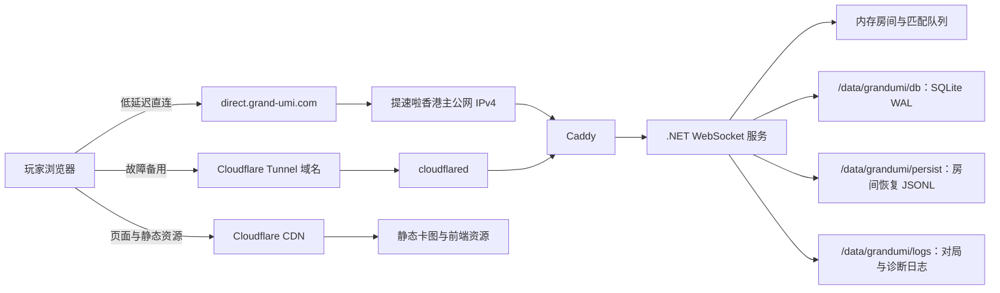

# GrandUMI 低成本 500 房间线上架构

- 文档版本：1.2
- 日期：2026-08-15
- 状态：新服务器已购买，数据盘已挂载，应用部署与容量认证尚未实施
- 当前实例成本：人民币 1,080 元/年（约 90 元/月，以控制台 2027-08-15 到期时间为准）
- 预算硬上限：人民币 1,000～1,200 元/月
- 目标环境：提速啦中国香港 CN2 云服务器

## 1. 文档目的

本文定义 GrandUMI 在尚未商业化阶段的低成本正式服架构。设计目标是在严格控制月成本的前提下，让单台服务器能够承载约 500 个同时活跃的双人对局房间，并尽量降低公网线路波动、弱网客户端和集中重连对正常对局的影响。

本文是容量与架构设计。新服务器和 `/data` 数据盘已经就绪，但不代表应用部署、Cloudflare Tunnel 接入、生产数据迁移、容量认证或正式流量切换已经完成。任何正式服变更仍须经过测试服验证和正式发布批准。

配套操作步骤见[《低成本 500 房间部署与运维说明书》](./低成本500房间部署与运维说明书.md)。

## 2. 设计结论

最终选择以下低成本单节点架构：

- 1 台提速啦中国香港 CN2 云服务器，作为新的单节点正式服候选机。
- 8 vCPU、8 GiB 内存、80 GiB 系统盘。
- 40 GiB XFS 数据盘挂载到 `/data`，承载数据库、房间恢复日志和备份。
- 套餐标称 75 Mbps CN2 公网带宽、2 个公网 IPv4；带宽质量和第二个地址仍须实测验收。
- 正式业务出口先整形为 60 Mbps，保留约 15 Mbps 给重传、Tunnel、SSH、监控和突发。
- 提速啦公网直连和 Cloudflare Tunnel 形成两条逻辑源站路径。
- 继续使用当前 .NET 单进程游戏服务、SQLite WAL 和本地房间恢复日志。
- 通过客户端换线、增量快照、消息合并、慢客户端隔离和广播收敛支撑目标容量。
- 不引入 RDS、Redis、GA、第二台游戏节点或付费负载均衡。

该架构可以解决性能和部分线路故障，但不能解决整台服务器或地域故障。单机故障是当前预算下明确接受的风险。

与旧的 4 核/200 Mbps 方案相比，新机的 CPU 余量更大，但公网出口从设计值 200 Mbps 降为标称 75 Mbps，因此容量瓶颈从“CPU 与线路共同约束”转为“优先验证线路与实际发送字节”。500 房间仍是目标容量，不是购买完成后的承诺容量；若活跃压测突破 45/55 Mbps 阈值，应先降低观战或房间准入上限。

## 3. 目标与非目标

### 3.1 目标

1. 支撑 500 个同时活跃的双人房间，即约 1,000 名对局玩家。
2. 支撑大厅、观战和重连产生的额外连接，总连接目标为 1,600。
3. 在正常网络条件下，对局操作到状态下发 P95 小于 100 ms，P99 小于 250 ms。
4. 单条公网路径异常时，客户端能够自动选择可用线路并恢复登录或对局。
5. 慢客户端或集中重连不能拖垮其他正常房间。
6. 当前固定服务器成本按 90 元/月摊销，日常基础设施总成本目标不超过 250 元/月，硬上限仍为 1,200 元/月。
7. 容量不足时优先拒绝新连接或新房间，保护已经开始的对局。

### 3.2 非目标

以下能力不在本阶段范围内：

- 双机热备和跨可用区容灾。
- 游戏节点故障后的完全无感接管。
- Redis 分布式匹配和跨节点房间目录。
- 托管 PostgreSQL/RDS。
- 面向中国大陆的全量付费跨境专线或 GA 加速。
- 无限观战人数。
- 保证套餐标称的 75 Mbps 在所有时段均可达到，或保证“CN2”营销名称等同于独享专线 SLA。

## 4. 容量口径

“500 个房间”必须按以下口径理解：

| 项目 | 设计值 |
| --- | ---: |
| 活跃对局房间 | 500 |
| 每房间玩家 | 2 |
| 对局玩家 | 1,000 |
| 观战连接 | 不超过 300 |
| 大厅、登录和重连冗余连接 | 不超过 300 |
| 总 WebSocket 目标 | 1,600 |
| 房间准入保护上限 | 最终 600 |
| 资格压测房间数 | 650～750 |

500 房间不是允许无限附加观战者。观战者同样接收状态快照，会直接放大序列化和出口带宽。若未来出现热门房间大量观战，需要独立建设观战广播层，不能继续沿用本架构的容量结论。

## 5. 当前能力基线

当前服务端已经具备以下扩容基础：

- Kestrel WebSocket 服务和连接/房间容量保护。
- 每个房间独立的有界串行操作队列。
- 每个连接独立的有界发送队列。
- 关键、普通、尽力而为三级消息优先级。
- 可替换状态快照合并，避免慢客户端无限积压。
- 客户端协商增量状态快照，每 32 个增量强制一次完整快照。
- 本地房间动作日志和重启恢复。
- `/live`、`/ready`、`/version`、`/metrics` 诊断端点。
- systemd 自动重启和正式发布前等待连接排空。
- 一分钟网络、TCP 和应用容量监控。

历史压测记录显示：

- 1,000/1,000 WebSocket 成功建立。
- 1,000 名玩家、500 个房间完成登录、匹配、先后手和调度手牌流程。
- 该次测试稳态工作集约 283 MiB。
- 没有异常断线、消息丢弃或持久化丢弃。

历史测试证明程序能够创建并维持 500 个房间，但不能单独证明 500 个房间在一小时连续真实操作、观战和集中重连时仍然稳定。因此最终容量必须由增强压测重新认证。

相关实现：

- [`服务端WebSocket/Diagnostics/ServerCapacity.cs`](../服务端WebSocket/Diagnostics/ServerCapacity.cs)
- [`服务端WebSocket/WsSession.cs`](../服务端WebSocket/WsSession.cs)
- [`服务端WebSocket/SnapshotWireCodec.cs`](../服务端WebSocket/SnapshotWireCodec.cs)
- [`服务端WebSocket/Game/GameRoomManager.cs`](../服务端WebSocket/Game/GameRoomManager.cs)
- [`changelog-cache/published/2026.08.08.2/2026-08-08-server-scalability-stability.md`](../changelog-cache/published/2026.08.08.2/2026-08-08-server-scalability-stability.md)

## 6. 逻辑架构



### 6.1 路径说明

1. 静态页面、卡图和音效通过 Cloudflare CDN 提供，不占用游戏消息处理能力。
2. WebSocket 首选可根据实测延迟在提速啦直连和 Tunnel 之间选择。
3. 直连故障时，客户端切换到 Tunnel；Tunnel 通过服务器主动建立的出站连接绕开源站公网入站路径。
4. 两条路径最终连接同一个 Caddy 和同一个游戏服务进程，因此只提供线路冗余，不提供计算节点冗余。

## 7. 服务器配置

### 7.1 必选规格

| 资源 | 要求 |
| --- | --- |
| 实例族 | 提速啦香港 CN2 云服务器 |
| 地域 | 中国香港 |
| CPU | 8 vCPU |
| 内存 | 8 GiB |
| 系统盘 | 80 GiB |
| 数据盘 | 40 GiB，XFS，挂载到 `/data` |
| 公网带宽 | 标称 75 Mbps CN2，必须实测持续吞吐、丢包和抖动 |
| 流量计费 | 套餐内固定带宽；部署前再次确认无超额按量费用 |
| 公网地址 | 套餐标注 2 个固定 IPv4；已确认主地址 `103.146.230.37`，第二地址待控制台核对 |
| 操作系统 | Ubuntu 24.04 LTS |

8 vCPU 为房间逻辑、序列化、GC、TLS 和集中重连提供了更高的 CPU 余量；8 GiB 内存仍足以覆盖当前历史压测工作集，但不能因此跳过一小时活跃房间压测。40 GiB 数据盘容量不大，日志和本机备份必须设置保留策略，并保留实例外副本。

### 7.2 套餐硬门槛

部署前必须同时满足：

- 当前实例页显示 1,080 元/年、2027-08-15 到期；商品标题中的“960 元 2 年”不能作为实际服务期限依据。
- 8 vCPU、8 GiB、80 GiB 系统盘和 40 GiB 数据盘均已在系统内核对。
- `/dev/vdb1` 以 XFS 挂载到 `/data`，并已写入 `/etc/fstab`。
- 75 Mbps 为套餐标称值；必须完成大陆主要运营商晚高峰的吞吐、丢包、抖动和 WebSocket 长连接验证。
- 地域为中国香港。
- 主公网 IPv4 固定，第二公网 IPv4 的绑定和路由行为已经查明。

任意一项不满足都应停止正式切流并重新评估。已购买不等于已通过生产验收。

### 7.3 操作系统资源建议

| 参数 | 目标 |
| --- | ---: |
| 服务文件句柄上限 | 65,535 或更高 |
| TCP 监听积压 | 4,096 或更高 |
| conntrack 上限 | 65,536 或更高 |
| Swap | 2～4 GiB，仅作故障缓冲 |
| 时间同步 | systemd-timesyncd/chrony 正常 |
| 系统盘预警 | 使用率达到 70% 告警，80% 立即处理 |
| 数据盘预警 | `/data` 使用率达到 65% 告警，75% 立即处理 |

Swap 不能被当作可用内存扩容。持续使用 Swap 表示进程存在内存压力，应停止扩大容量。

## 8. 网络设计

### 8.1 出口整形

套餐标称 75 Mbps CN2，但不能按独享、无抖动线路理解。正式业务在新服务器上先使用 60 Mbps HTB 整形：

- 业务可用上限：60 Mbps。
- 预留：约 15 Mbps。
- 预留用于 TCP 重传、Tunnel、SSH、监控和瞬时突发。
- 仓库当前 `grandumi-network-tuning.service` 的 `2mbit` 是旧服临时排障值，禁止原样用于新服务器。
- 启用生产流量前必须通过 `tc -s class show dev <默认网卡>` 确认实际为 `60Mbit`，既不是 `2Mbit`，也不是无限速。

如果 5 分钟平均出口达到 45 Mbps 或 P95 达到 55 Mbps，应先限制观战、新房间和完整快照比例，而不是提高整形上限。只有供应商实测证明 75 Mbps 能稳定交付、且 TCP 重传、qdisc 丢弃和应用发送队列都正常，才可在隔离压测中评估 65 Mbps；不得直接解除整形。

套餐中的 2 个公网 IPv4 仍共享同一台服务器和同一供应商网络，不能视为两条独立线路，也不会把总带宽叠加为 150 Mbps。第二地址只可在独立验证后用于备用入口、迁移或探针，不默认加入多 A 记录轮询。

### 8.2 客户端择路目标

客户端现已具备：

- 直连和 Tunnel 两端点探测。
- 运行时 JSON 线路清单，入口变更无需重新构建前端。
- 首次连接按优先级和最近成功记录选择端点。
- 最近成功线路记忆。
- 单线路连续失败 2 次后的 45 秒熔断，并在全部熔断时半开探测最早恢复线路。
- 指数退避加随机抖动。
- 浏览器重新联网或恢复前台时立即重试。
- 页面恢复前台或浏览器从休眠返回时立即心跳探测；现有健康 WebSocket 不主动迁移。
- 按入口上报握手、RTT、失败和重连摘要，服务端只记录聚合指标，不上报账号或令牌。

上述客户端能力已在代码和自动化测试中完成。当前候选机只有公网 IP 直连入口；Cloudflare Tunnel 或第三方独立中继仍需在正式域名准备后接入并完成真实 IPv4/IPv6 验证。单机上的第二公网 IP 不能替代独立中继。

### 8.3 带宽容量公式

监控必须记录每种协议实际发送字节数。估算公式为：

```text
出口 Mbps = 每秒发送次数 × 平均消息字节数 × 8 ÷ 1,000,000 × 协议开销系数
```

协议开销系数建议按 1.20～1.30 估算。观战者数量、完整快照比例和集中重连是主要放大因素。

## 9. 应用层容量策略

### 9.1 容量参数分阶段提升

不能在新服务器上线后立即把限制一次性提高到最终值。

| 阶段 | 最大连接 | 最大房间 | 进入条件 |
| --- | ---: | ---: | --- |
| 当前基线 | 1,000 | 400 | 当前默认保护值 |
| A | 1,200 | 450 | 新服务器、`/data`、60 Mbps 整形和基础服务验证通过 |
| B | 1,400 | 550 | 500 房间活跃压测通过，出口仍满足 45/55 Mbps 阈值 |
| C | 1,600 | 600 | 650～750 房间资格压测通过，且观战与重连风暴仍满足带宽阈值 |

正式运营目标始终是 500 房间。600 是准入保护上限，不是常态经营目标。

### 9.2 必须完成的低成本优化

以下项目是 500 房间正式认证前的必要条件：

1. 在线账号数只有实际变化时才全服广播。
2. 同账号线路替换不触发全服在线人数广播。
3. 大厅状态按 500 ms～1 s 合并。
4. 按协议统计发送次数、原始字节数和最终字节数。
5. 慢客户端持续积压时优先丢弃可重建状态，并触发重新同步。
6. 关键操作、Prompt、拒绝和结算消息不能被快照挤占。
7. 客户端集中重连必须有抖动和线路熔断。
8. 静态资源不得通过游戏 WebSocket 下发。
9. 所有改变对局状态的请求必须携带 `requestId`；服务端在每个房间保存 10 分钟、最多 512 条的幂等窗口，重复请求只回权威快照、不重复执行。

### 9.3 观战约束

- 正式容量模型最多预留约 300 个观战连接。
- 建议增加全局观战连接保护值。
- 单房间建议默认不超过 2～4 名观战者。
- 超出限制时应友好拒绝新观战，不影响房间内两名玩家。
- 热门赛事或公开直播应使用独立转播方案。

## 10. 数据与持久化

### 10.1 当前方案

- 程序和发布目录保留在 `/opt/grandumi`，不与持久化数据混放。
- 玩家、卡组、好友等 SQLite WAL 数据放在 `/data/grandumi/db`。
- 排位、Leader 统计等 SQLite 文件继续独立保存，但统一位于 `/data/grandumi/db`。
- 每个进行中的 PvP 房间使用 `/data/grandumi/persist` 下的 JSONL 动作日志恢复。
- 文件日志位于 `/data/grandumi/logs`，本机在线备份位于 `/data/grandumi/backups`。
- 房间结束后异步删除恢复日志。
- 私有完整快照日志保持关闭，避免每房间约 63 KiB 的快照持续写盘。

建议目录：

```text
/opt/grandumi/                 程序、静态资源和发布脚本
/data/grandumi/db/             SQLite 主数据与 WAL
/data/grandumi/persist/        未结束房间恢复日志
/data/grandumi/logs/           文件日志和导出诊断
/data/grandumi/backups/        本机短期在线备份
```

### 10.2 数据保护

- 每次系统或正式版本变更前创建供应商快照；免费快照和完整镜像的实际范围必须在控制台核对。
- 每日对 SQLite 执行在线备份，而不是直接复制正在写入的数据库主文件。
- 每日备份最近未结束的房间恢复日志。
- 每周至少将一份备份保存到实例之外。
- 每月执行一次恢复演练。
- 保留 7 份每日备份和 4 份每周备份即可，避免磁盘无限增长。

同一块 `/data` 数据盘内的备份只能防止误操作，不能防止整盘或整机故障；实例外副本仍是必需项。

### 10.3 迁移触发条件

满足任一条件后，应重新评估 PostgreSQL/Redis：

- 项目开始产生稳定收入。
- 单机 SQLite 写锁或查询延迟影响对局。
- 需要第二个游戏节点。
- 需要跨节点匹配、房间接管或滚动升级。
- 月活玩家和数据规模显著增长。

## 11. 可观测性

### 11.1 必须监控

服务器层：

- CPU 使用率和 load average。
- 内存、Swap 和 OOM。
- 磁盘使用率、I/O 延迟和 inode。
- 网卡出入站 Mbps。
- qdisc drops/overlimits。
- TCP RetransSegs 和超时增量。
- 当前 TCP/WebSocket 连接数。

应用层：

- 当前连接、登录玩家、房间和观战人数。
- 房间操作队列深度。
- WebSocket 发送队列深度。
- 合并和丢弃消息数。
- RoomJournal 和 MatchLog 队列深度/丢弃数。
- 操作处理、快照构建、发送排队 P50/P95/P99/Max。
- 按协议的消息数和字节数。

外部探针：

- DNS 解析。
- TCP 连接。
- TLS 握手。
- WebSocket 101 升级。
- 应用握手和测试 Ping。
- IPv4 与 IPv6 分开记录。
- 直连与 Tunnel 分开记录。

### 11.2 告警阈值

| 指标 | 警告 | 严重 |
| --- | ---: | ---: |
| CPU 5 分钟平均 | 60% | 75% |
| 内存使用率 | 70% | 85% |
| Swap 持续使用 | > 128 MiB | > 512 MiB |
| 磁盘使用率 | 70% | 80% |
| 出口带宽 5 分钟平均 | 45 Mbps | 55 Mbps |
| WebSocket 队列 P99 | 30 ms | 50 ms |
| 应用消息丢弃 | 任意增长 | 持续增长 |
| 持久化队列丢弃 | 任意增长 | 持续增长 |
| `/ready` | 单次失败 | 连续 3 次失败 |

## 12. 服务等级目标

在单机预算范围内采用内部目标，而不是对外承诺 SLA：

- WebSocket 握手成功率：不低于 99.5%。
- 健康线路下握手 P95：小于 1.5 秒。
- 单线路故障后重连恢复 P95：小于 5 秒。
- 对局操作到状态下发 P95：小于 100 ms。
- 对局操作到状态下发 P99：小于 250 ms。
- 应用关键消息丢弃：0。
- 持久化动作丢弃：0。

这些目标不包含提速啦整机不可用、地域级故障或玩家本地断网。

## 13. 故障模型

| 故障 | 预期行为 | 当前能力边界 |
| --- | --- | --- |
| 提速啦公网直连异常 | 客户端切到 Tunnel | 需完成 Tunnel 和端点验证 |
| 第二公网 IPv4 异常 | 不自动轮询；继续使用已验证主地址或 Tunnel | 两个地址不是独立计算/线路冗余 |
| Cloudflare 路径异常 | 客户端切到直连 | 已有多端点基础 |
| 单个弱网玩家 | 合并状态、限制队列、必要时重同步 | 已有有界发送队列 |
| 集中重连 | 抖动、熔断、广播收敛 | 部分待优化 |
| 后端进程崩溃 | systemd 重启，房间从动作日志恢复 | 会发生短时全服重连 |
| SQLite 文件损坏 | 从最近备份恢复 | 会丢失备份点后的长期数据 |
| 整台服务器故障 | 人工恢复或重建 | 当前没有自动容灾 |
| 香港地域网络大范围异常 | 等待恢复或临时迁移 | 预算内无法完全解决 |

## 14. 预算模型

| 项目 | 实际/目标月均 |
| --- | ---: |
| 8 核 8G、75 Mbps、80G+40G 套餐（1,080 元/12 月） | 90 元 |
| 域名摊销、实例外备份、低成本探针 | 0～100 元 |
| 预留不可预计小额费用 | 50 元 |
| 日常目标合计 | 不超过 250 元 |
| 预算硬上限 | 1,200 元 |

Cloudflare Tunnel 本身不应成为主要固定成本。不使用按量付费的高额跨境加速、托管数据库或托管 Redis。

成本保护规则：

1. 核对订单和控制台，确认套餐外没有按量流量费用。
2. 续费前重新核对原价、带宽和线路说明，不把首购优惠视为永久价格。
3. 不开启按量付费的高额跨境加速。
4. 所有按量服务设置账单告警。
5. 每月检查账单明细和异常出口流量。

## 15. 容量认证

### 15.1 测试层级

1. 连接测试：1,600 个 WebSocket，持续 30 分钟。
2. 建房测试：1,300～1,500 名玩家，650～750 个房间。
3. 活跃测试：持续执行真实出牌、攻击、反击、选择和快照至少 60 分钟。
4. 观战测试：额外加入 200～300 名观战者。
5. 重连测试：每 5～10 分钟让 10% 客户端集中断线并恢复。
6. 结束测试：短时间内批量投降或结束全部房间。
7. 恢复测试：在隔离环境中重启后端并验证未结束房间恢复。

现有 `tools/load/match-soak.mjs` 主要验证登录、匹配和房间就绪，不能单独作为“持续活跃 500 房间”认证。需要先扩充真实操作负载或增加新的活跃对局压测脚本。

### 15.2 通过标准

- CPU 平均低于 50%，P95 低于 65%，瞬时峰值低于 80%。
- 内存稳定低于 60%，60 分钟内无持续增长趋势。
- Swap 不持续增长。
- 消息丢弃和持久化丢弃均为 0。
- 房间操作队列绝大多数时间为 0。
- WebSocket 发送队列 P99 小于 50 ms。
- 对局状态下发 P99 小于 250 ms。
- `/ready` 全程返回 200。
- 10% 重连风暴后 95% 客户端在 5 秒内恢复。
- 出口 5 分钟平均不超过 45 Mbps，P95 不超过 55 Mbps，且 60 Mbps qdisc 无持续丢弃。

任何一项失败都不能提高正式服容量上限。

## 16. 实施顺序

1. 补齐消息字节数、外部路径和广播指标。
2. 完成在线人数广播收敛。
3. 完成客户端线路熔断、抖动和 Tunnel 端点支持。
4. 在测试服完成回归和移动端验证。
5. 在新服务器创建 `/data/grandumi` 目录、安装运行环境并部署隔离实例，旧正式服继续服务。
6. 将网络整形从仓库临时值 `2mbit` 调整为新机专用的 `60mbit`，完成重启持久化验证。
7. 使用临时域名验证新机的直连、Tunnel、TLS、WebSocket、数据库和短对局。
8. 在隔离环境完成 500 房间认证，确认 75 Mbps 套餐在晚高峰仍满足 45/55 Mbps 阈值。
9. 开启旧正式服维护模式，等待房间归零并完成最终 SQLite 在线备份与校验。
10. 将最终数据同步到新机，先以 1,200 连接/450 房间开放灰度流量。
11. 观察稳定后再切换正式域名；旧服务器保留至少 7 天作为人工回退节点。
12. 500 房间活跃认证通过后提高至 1,400/550；650～750 房间认证通过后再提高至 1,600/600。

## 17. 后续升级触发点

以下情况出现后，再考虑企业级架构：

- 月收入能够持续覆盖至少 5,000 元基础设施成本。
- 常态房间超过 400，峰值经常接近 500。
- 单机 CPU P95 超过 65%。
- 单机维护窗口已经不可接受。
- 玩家要求高可用或赛事级稳定性。
- 需要超过 300 个同时观战连接。

届时的升级方向为双 WebSocket 网关、双游戏节点、Redis 房间目录和高可用 PostgreSQL，而不是继续无上限地增加单机规格。

## 18. 参考资料

- 提速啦订单与服务器控制台（2026-08-15，内部购买记录）
- [Cloudflare Tunnel](https://developers.cloudflare.com/cloudflare-one/networks/connectors/cloudflare-tunnel/)
- [Cloudflare Tunnel 高可用和故障切换](https://developers.cloudflare.com/cloudflare-one/networks/connectors/cloudflare-tunnel/configure-tunnels/tunnel-availability/)
