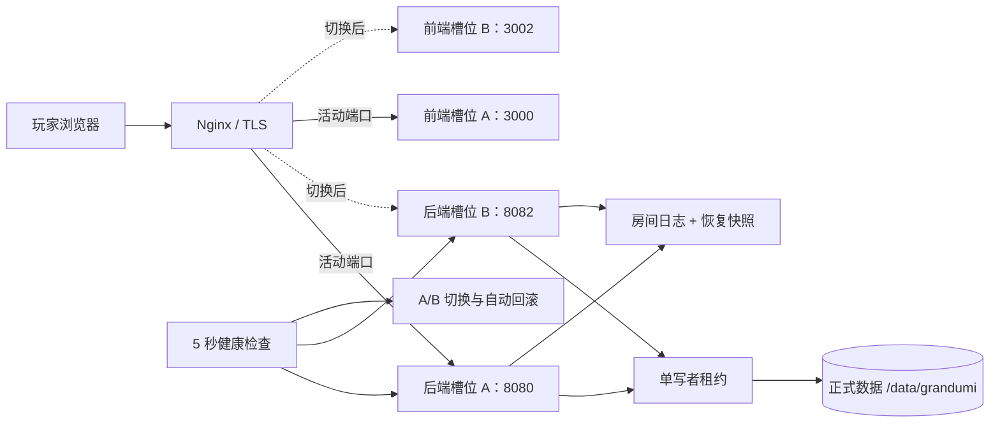

# GrandUMI 单机高可用与故障恢复说明书

日期：2026-08-15
适用主机：香港正式服 `103.146.230.37`（8 核、8 GB、75 Mbps CN2）

## 1. 目标与边界

本方案在不增加第二台物理机的前提下，处理以下故障：

- 后端进程崩溃、卡死或就绪检查持续失败；
- 新版本启动失败、健康检查失败；
- 单次系统服务重启或整机重启；
- 构建任务抢占在线对局的 CPU、内存或磁盘 I/O；
- 玩家断线后重复提交同一动作。

单机方案不能处理物理机掉电、宿主机故障、香港公网入口整体中断、系统盘同时损坏等主机级故障。此类故障要做到无感，仍需要第二台机器或云负载均衡。

## 2. 架构



正式服通过 `GRANDUMI_REQUIRE_SINGLE_WRITER=1` 强制任何时刻只允许一个后端持有 `/data/grandumi/.grandumi-writer.lock`。即使运维误启动两个槽位，第二个进程也会在打开玩家数据库前退出，避免 SQLite 和房间日志双写；测试服等独立数据环境不会误占正式租约。

## 3. 七项措施的落地方式

### 3.1 房间状态快照

- PvP 房间创建时立即生成一份私有恢复检查点。
- 每 16 个已接受动作更新一次原子快照，正常停服前再捕获一次。
- 快照保存完整私有状态、棋钟、服务端动作序号、最近幂等请求窗口和状态 SHA-256。
- 因部分卡牌效果含异步续延，快照不直接反序列化成运行中对象；启动时仍以确定性动作重放为准，并用快照哈希校验重放结果。

### 3.2 操作事件日志

- 每局使用独立 JSONL，保存建房头、已接受动作、动作序号、`requestId`、棋钟和 UTC 时间。
- 写入由单线程有序队列完成，避免磁盘 I/O 阻塞房间串行队列。
- 损坏日志不再静默删除，而是移动到 `Persist/quarantine/` 留待排查。
- 正常结束的房间同时清理日志与快照。

### 3.3 重连令牌与幂等序号

- 浏览器已有的短期 `authToken` 是重连身份令牌；重连必须先通过账号令牌认证，服务端才按账号重新绑定原座位。
- 每个已接受动作获得递增的服务端日志序号。
- 客户端 `requestId` 随动作日志和快照持久化；进程重启后最近 10 分钟、最多 512 个请求仍可去重。
- 重复请求只返回权威快照，不重复结算。

### 3.4 本机备用后端

- A/B 槽位端口分别为 `8080`、`8082`，前端为 `3000`、`3002`。
- 备用后端平时停止，保留上一份已验证发布包，不占用运行内存。
- 主槽位连续三次就绪失败后先重启原槽；8 秒内仍未恢复才启动备用槽。
- 切换期间玩家 WebSocket 会短暂重连，但房间从持久化日志恢复，目标是在 90 秒断线宽限期内完成。

### 3.5 systemd 自动拉起与健康检查

- 后端和前端均使用 `Restart=always`、2 秒重启间隔和启动频率限制。
- `grandumi-production-health.timer` 每 5 秒检查活动后端 `/live`；容量过载时 `/ready` 可能主动返回 503，但不会因此误判为进程故障。
- 单次网络抖动不会切换；连续三次失败才进入自愈。
- 健康检查与切换均有 `flock`，避免多个自愈任务并发执行。

### 3.6 蓝绿发布与自动回滚

- 发布包存放在 `/opt/grandumi/releases/<commit>/`，不覆盖活动槽位文件。
- 预构建使用 `/opt/grandumi-build/<commit>/` 独立 Git worktree；不会 checkout 正在提供静态资源的仓库，也不会移动活动 `.next`。
- 约 2 GB 的版本化卡图通过 `rsync --link-dest` 与上一活动版本共享未变化文件的数据块，既可随槽位回滚，也不会每次发布重复占满磁盘。
- 构建完成后，正式批准切换时把发布包挂到空闲槽位。
- 先启动并验证新前端，再停旧后端、启动新后端并检查 `/ready`，最后原子替换 Nginx 活动端口。
- 任一步失败都会停止目标槽、恢复原槽、恢复 Nginx 指向和目标槽旧软链接。
- 正式服切换仍需要发布批准；测试服部署成功不等于正式服自动切换。

### 3.7 CPU、内存、磁盘与构建隔离

- 在线服务位于 `grandumi-production.slice`，享有高 CPU/I/O 权重，内存上限 6.5 GB。
- 构建位于 `grandumi-build.slice`，限制为 2 核、内存高水位 2 GB/上限 3 GB、低 I/O 权重。
- 后端单服务仍限制 6.5 核和 5 GB，前端限制 1.5 核和 1.5 GB，给系统、Nginx 和文件缓存留出余量。
- 备用后端停止时不占 CPU/内存；发布产物按提交隔离，回滚不需要重新构建。

## 4. 预期恢复指标

| 故障 | 预期表现 | 典型恢复时间 |
|---|---|---:|
| 后端进程直接崩溃 | systemd 原槽拉起，客户端自动重连 | 2～10 秒 |
| 原槽持续无法就绪 | 三次确认、原槽重启、再切备用槽 | 25～55 秒 |
| 新版本启动失败 | 自动恢复旧槽和旧 Nginx 指向 | 10～35 秒 |
| 整机重启 | 活动槽启动、日志重放、玩家重登 | 视房间数量约 20～90 秒 |
| 最近动作落盘窗口 | 大多数为 0；强杀瞬间可能损失最后一个约 20 ms 批次 | 小于一个日志批次 |

500 个同时存在的房间会增加启动重放时间，因此恢复演练必须记录实际 P95；若接近 90 秒，应降低单机房间上限或进一步做可直接反序列化的引擎状态格式。

## 5. 日常检查

```bash
sudo /usr/local/sbin/verify-grandumi-ha --check
systemctl status grandumi-production-health.timer
journalctl -u grandumi-production-health.service --since '1 hour ago'
cat /var/lib/grandumi-ha/active-slot
cat /var/lib/grandumi-ha/standby-slot
```

查看被隔离的恢复日志：

```bash
find /data/grandumi/Persist/quarantine -maxdepth 1 -type f -printf '%TY-%Tm-%Td %TT %p\n'
```

## 6. 无对局故障演练

演练命令会先读取 `/ready`，只在 `rooms=0` 时执行槽位切换；有任何房间都会拒绝：

```bash
sudo /usr/local/sbin/verify-grandumi-ha --switch-drill
```

演练后再次执行只读检查，并确认外网登录、匹配和图片资源正常。不要在玩家对局中手工停止服务或执行演练。

## 7. 发布操作

预构建不会切换正式流量：

```bash
GRANDUMI_PRODUCTION_IP=103.146.230.37 \
  bash /opt/grandumi/ops/server/stage-grandumi-production.sh <40位提交号>
```

经过测试服验证和正式发布批准后激活：

```bash
bash /opt/grandumi/ops/server/activate-grandumi-production.sh <40位提交号>
```

激活脚本首次运行会迁入 A/B 架构：若 `/data/grandumi` 已有三份完整正式数据库，则只校验并原地接管，绝不会被历史导入目录覆盖；只有真正的空白目录才允许导入。后续运行会自动选择空闲槽位。失败时不要手工删除 `/var/lib/grandumi-ha/`，先收集 systemd、Nginx 和 `Persist/quarantine` 日志。
